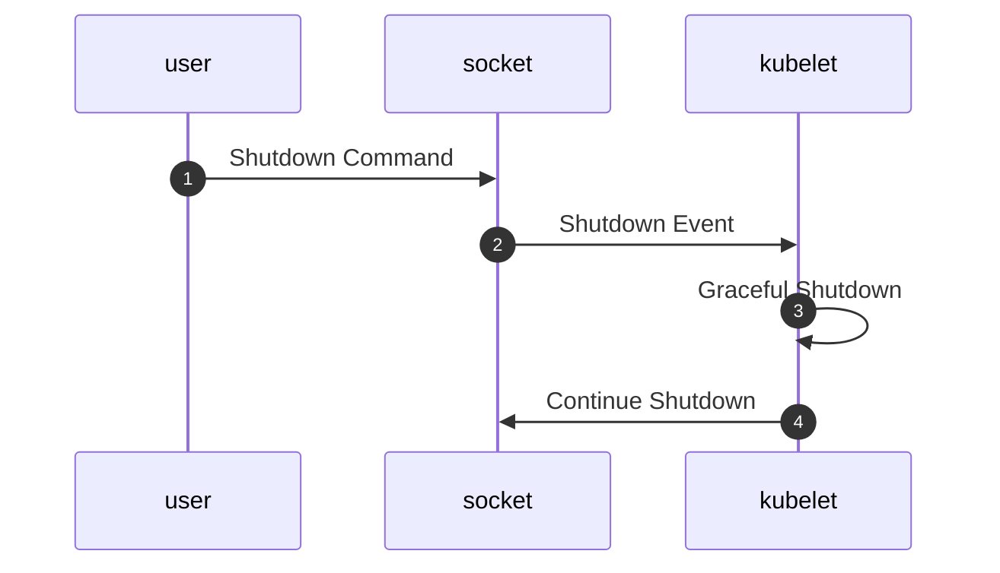

# System Socket

Kubernetes supports a feature known as
[Graceful Node Shutdown][node-shutdown] which allows the `kubelet` to
detect when the node it is running on is about to shutdown. When a
shutdown is initiated, `kubelet` requests that it is paused, and then
proceeds to attempt to evict all of its running Pods in according to
their defined shutdown rules.

In "vanilla" kubernetes, this feature is only supported on systems
managed by SystemD. kiOS does not use SystemD, however Graceful Node
Shutdown is clearly still a desirable feature.

As a result, the `kubelet` packaged with kiOS has been patched to be
able to talk to kiOS' own init process, via a socket it keeps open. We
call this the `system socket` which, for the purposes of Graceful
Shutdown, can be thought of as a very, very basic system-dbus type
component.

## Details

During startup, kiOS will open a socket at `/run/system.sock` which it
will use to listen for certain commands, and send out events to
listening clients.

Commands and Events are both transferred as single bytes.

### Commands

#### (Soft) Shutdown

`0x01`

If a client sends this byte, kiOS will begin the shutdown procedure: it
will send out a shutdown event to all clients, with the expectation that
`kubelet` will handle this.

#### Continue Shutdown

`0x02`

This command initiates a "conventional" shutdown - ie kiOS will stop,
then kill, any remaining running processes, umount all of the file
systems it can, sync all disks to avoid data loss, and then request a
shutdown from the kernel.

It is _expected_ that this command will be sent by the `kubelet` once it
has finished its own graceful shutdown procedure, however it can also be
used to force a shutdown (skipping graceful node shutdown).

#### Restart Kubelet

`0x03`

This command will cause kiOS to restart the `kubelet` process. This is
most useful if you have updated its configuration file and would like it
to pick up the changes.

### Events

#### Shutdown

`0x01`

If kiOS sends this event, it means that it has received instruction to
shutdown (either via the shutdown command over the system socket, or
via a `SIGTERM` sent to the init process.

It is expected that `kubelet` will listen for this and initiated a
Graceful Node Shutdown.

## Shutdown Example

